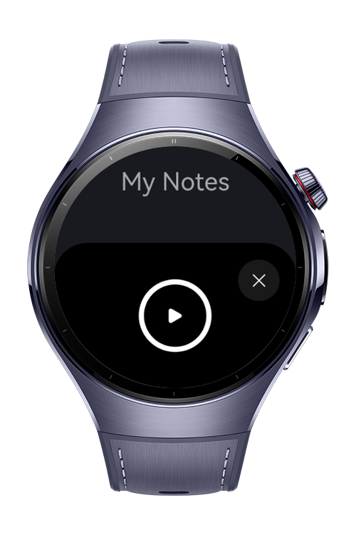

> **Note:** To access all shared projects, get information about environment setup, and view other guides, please visit [Explore-In-HMOS-Wearable Index](https://github.com/Explore-In-HMOS-Wearable/hmos-index).

# WVNotes (Voice Notes)

The app allows user to record and listen voice notes. All records all stored in the device.

# Preview

<div>
  
  
  
</div>

# Use Cases
- Record voice memos quickly and offline
- Browse and listen to previously saved notes
- Visual wave animation while recording 

# Technology

## Stack
- **Languages**: ArkTS, ArkUI
- **Frameworks**: HarmonyOS SDK 5.0.2(14)
- **Tools**: DevEco Studio Version 5.1.0.828
- **Libraries**:
  - `@kit.ArkUI`
  - `@kit.AbilityKit`
  - `@kit.BasicServicesKit`
  - `@kit.CoreFileKit`
  - `@kit.MediaKit`
  - `@kit.AudioKit`

## Required Permissions
- `ohos.permission.MICROPHONE`
  > Required for audio recording functionality during note creation.
  
# Directory Structure

```
entry/src/main/ets/
├───components                           
│       CircularWaveAnimation.ets        
│       Notes.ets
│       PlayerPage.ets
│       RecorderPage.ets
├───entryability
│       EntryAbility.ets
├───entrybackupability
│       EntryBackupAbility.ets
├───pages
│       Index.ets
├───service
│       Player.ets
│       Recorder.ets
│       Records.ets
└───viewmodel
        CircularWaveVM.ets 
```

# Constraints and Restrictions
## Supported Device

* Huawei Watch 5

# License

**WVNotes** is distributed under the terms of the MIT License
See the [LICENSE](./LICENSE) for more information.
